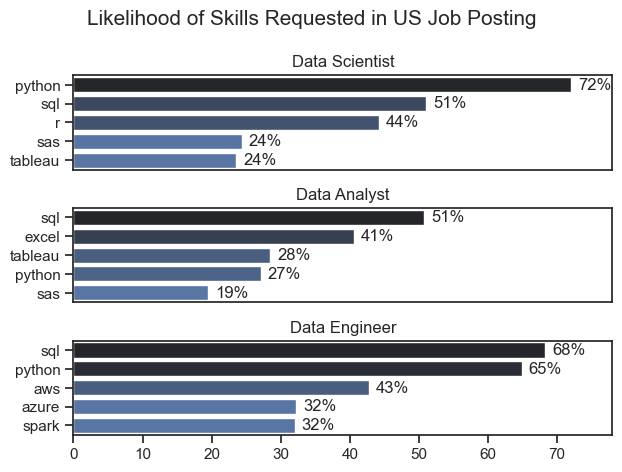
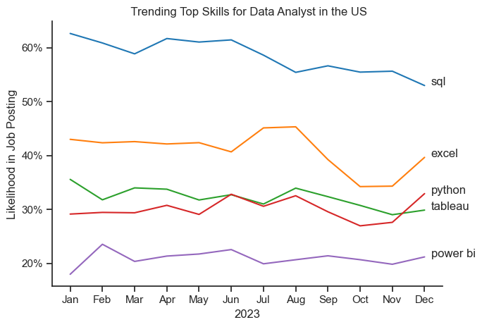
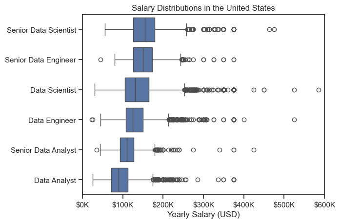
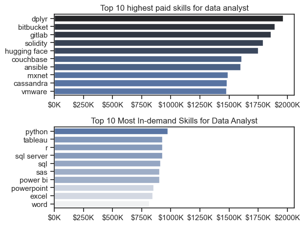

# The Analysis

## 1 . What are the most demanded skills for the top 3 most popular data roles?

To fins the most demanded skills for the top 3 most popular data roles. I filtered out those positions by which ones were the most popular, and got the top 5 skills for these top 3 roles. This query highlights the most popular job titles and their top skills, showing which skills I should pay attention to depending on the role I'm targeting.

View my notebook with detailed steps here:
[2_Skills_Count.ipynb]()

```python
fig, ax = plt.subplots(len(job_titles), 1)

sns.set_theme(style='ticks')

for i, job_title in enumerate(job_titles):
    df_plot = df_skills_perc[df_skills_perc['job_title_short'] == job_title].head(5)
    #df_plot.plot(kind='barh', x='job_skills', y='skill_percent', ax=ax[i], title=job_title)
    sns.barplot(data=df_plot, x='skill_percent', y='job_skills', ax=ax[i], hue='skill_count', palette='dark:b_r')
    ax[i].set_title(job_title)
    ax[i].set_ylabel('')
    ax[i].set_xlabel('')
    ax[i].legend().set_visible(False)
    ax[i].set_xlim(0, 78)

    for n, v in enumerate(df_plot['skill_percent']):
        ax[i].text(v + 1, n, f'{v:.0f}%', va='center')
    
    if i != len(job_titles) - 1:
        ax[i].set_xticks([])

fig.suptitle('Likelihood of Skills Requested in US Job Posting',fontsize=15)   
fig.tight_layout()
```


### Insights
- Python is a versatile skill, highly demanded across all three roles, but most prominently for Data Scientist (72%) and Data Engineers (65%).
- SQL is the most requested skill for Data Analyst and Data Scientists, with it in over half the job postings for both roles. For Data Engineers, Python is the most sought-after skill, appearing in 68% of job postings. 
- Data Engineers require more specialized technical skills(AWS, Azure, Spark) compared to Data Analysts and Data Scientists who are expected to be proficient in more general data management and analysis tools. (Excel, Tableau)

## 2. How are in demand skills trending for Data Analyst ? 
### Visualize Data

```python
sns.lineplot(data=df_plot, dashes=False, palette='tab10')

sns.set_theme(style='ticks')

plt.title(' Trending Top Skills for Data Analyst in the US')
plt.ylabel('Likelihood in Job Posting')
plt.xlabel('2023')
plt.legend().set_visible(False)
plt.tight_layout()
sns.despine()

from matplotlib.ticker import PercentFormatter
ax=plt.gca()
ax.yaxis.set_major_formatter(PercentFormatter(decimals=0))


for i in range(5):
    plt.text(11.2, df_plot.iloc[-1, i], df_plot.columns[i])
 
plt.show() 
```

*Bar graph visualizing the trending top skills for data analyst in the US in 2023.*

### Insights
- SQL remains the most consistently demanded skill throughout the year, although it shows a gradual decrease in demand.
- Excel experienced a significant increase in demand starting around September, surpassing both Python and Tableau by the end of the year.
- Both Python and Tableau show relatively stable demand throughout the year with some fluctuations but remain essential skills for data analysts. Power BI, while less demanded compared to the others, shows a slight upward trend towards the year's end.

# 3. How well do jobs and skills pay for Data Analysts ? 

#### Visualize Data
```python
sns.boxplot(data=df_US_top6, x='salary_year_avg', y='job_title_short',order=job_order_df_US_top6)
sns.set_theme(style='ticks')

plt.title('Salary Distributions in the United States')
plt.xlabel('Yearly Salary (USD)')
plt.ylabel('')
plt.xlim(0, 600000)
ticks_x = plt.FuncFormatter(lambda y, pos: f'${int(y/1000)}K')
plt.gca().xaxis.set_major_formatter(ticks_x)
plt.show()
```

#### Results


#### Insights 

- There's a significant variation in salary ranges across different job titles. Senior Data Scientist positions tend to have the highest salary potential, with up to $600K, indicating the high value placed on advanced data skills and experience in the industry.

- Senior Data Engineer and Senior Data Scientist roles show a considerable number of outliers on the higher end of the salary spectrum, suggesting that exceptional skills or circumstances can lead to high pay in these roles. In contrast, Data Analyst roles demonstrate more consistency in salary, with fewer outliers.

- The median salaries increase with the seniority and specialization of the roles. Senior roles (Senior Data Scientist, Senior Data Engineer) not only have higher median salaries but also larger differences in typical salaries, reflecting greater variance in compensation as responsibilities increase.

### Highest Paid & Most Demanded Skills for Data Analysts
Next, I narrowed my analysis and focused only on data analyst roles. I looked at the highest-paid skills and the most in-demand skills. I used two bar charts to showcase these.

#### Visualize Data
```python
fig, ax = plt.subplots(2,1)

sns.set_theme(style='ticks')

sns.barplot(data=df_DA_top_pay, x='median', y=df_DA_top_pay.index, ax=ax[0], hue='median', palette=('dark:b_r'))
#df_DA_top_pay[::-1].plot(kind='barh', y='median', ax=ax[0], legend=False)
ax[0].set_xlim(ax[0].get_xlim())
ax[0].set_title('Top 10 highest paid skills for data analyst')
ax[0].set_ylabel('')
ax[0].set_xlabel('')
ax[0].xaxis.set_major_formatter(plt.FuncFormatter(lambda x, _: f'${int(x/100)}K')) 
ax[0].legend().remove()                                            

sns.barplot(data=df_DA_skills, x='median', y=df_DA_skills.index, ax=ax[1], hue='median',palette=('light:b'))
#df_DA_skills[::-1].plot(kind='barh', y='median', ax=ax[1], legend=False)
ax[1].set_xlim(ax[1].get_xlim())
ax[1].set_title('Top 10 Most In-demand Skills for Data Analyst')
ax[1].set_ylabel('')
ax[1].set_xlabel('')
ax[1].xaxis.set_major_formatter(plt.FuncFormatter(lambda x, _: f'${int(x/100)}K'))
ax[1].set_xlim(ax[0].get_xlim())
ax[1].legend().remove()

fig.tight_layout()
plt.show()
```

#### Result
Here's the breakdown of the highest-paid & most in-demand skills for data analysts in the US:



# 4. What are the most optimal skills to learn for Data Analysts?
