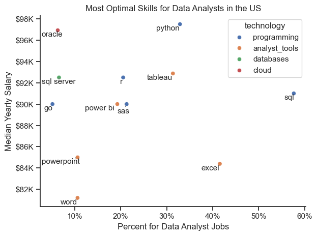

# Overview
Welcome to my analysis of the data job market, with a focus on data analyst roles. This project was driven by a desire to better understand and navigate the job market. It explores top-paying and in-demand skills to identify the best job opportunities for data analysts.

The data used comes from Luke Barousse's Python Course, providing a foundation for the analysis, including job titles, salaries, locations, and key skills. Using Python scripts, I explore important questions such as the most in-demand skills, salary trends, and the relationship between demand and salary in data analytics.

# The Questions

Below are the questions I want to answer in my project:

1. What are the skills most in demand for the top 3 most popular data roles?

2. How are in-demand skills trending for Data Analysts?

3. How well do jobs and skills pay for Data Analysts?
What are the optimal skills for data analysts to learn? (High Demand AND High Paying)

# Tools I Used

For my deep dive into the data analyst job market, I harnessed the power of several key tools:

- **Python:** The backbone of my analysis, allowing me to analyze the data and find critical insights.I also used the following Python libraries:
    - **Pandas Library:** This was used to analyze the data.
    - **Matplotlib Library:** I visualized the data.
    - **Seaborn Library:** Helped me create more advanced visuals.
- **Jupyter Notebooks**: The tool I used to run my Python scripts which let me easily include my notes and analysis.
- **Visual Studio Code:** My go-to for executing my Python scripts.
- **Git & GitHub:** Essential for version control and sharing my Python code and analysis, ensuring collaboration and project tracking.

# Data Preparation and Cleanup

This section outlines the steps taken to prepare the data for analysis, ensuring accuracy and usability.

### Import & Clean Up Data

I start by importing necessary libraries and loading the dataset, followed by initial data cleaning tasks to ensure data quality.

```python
# Importing Libraries
import ast
import pandas as pd
import seaborn as sns
from datasets import load_dataset
import matplotlib.pyplot as plt  

# Loading Data
dataset = load_dataset('lukebarousse/data_jobs')
df = dataset['train'].to_pandas()

# Data Cleanup
df['job_posted_date'] = pd.to_datetime(df['job_posted_date'])
df['job_skills'] = df['job_skills'].apply(lambda x: ast.literal_eval(x) if pd.notna(x) else x)
```

## Filter US Jobs

To focus my analysis on the U.S. job market, I apply filters to the dataset, narrowing down to roles based in the United States.

```python
df_US = df[df['job_country'] == 'United States']
```

# The Analysis

## 1. What are the most demanded skills for the top 3 most popular data roles?

To find the most in-demand skills for the top 3 popular data roles, I identified the top roles and then listed the top 5 skills for each. This query shows the most common job titles and their key skills, helping me understand which skills to focus on based on the role I want to pursue.

View my notebook with detailed steps here:
[2_Skills_Count.ipynb]()

```python
fig, ax = plt.subplots(len(job_titles), 1)

sns.set_theme(style='ticks')

for i, job_title in enumerate(job_titles):
    df_plot = df_skills_perc[df_skills_perc['job_title_short'] == job_title].head(5)
    #df_plot.plot(kind='barh', x='job_skills', y='skill_percent', ax=ax[i], title=job_title)
    sns.barplot(data=df_plot, x='skill_percent', y='job_skills', ax=ax[i], hue='skill_count', palette='dark:b_r')
    ax[i].set_title(job_title)
    ax[i].set_ylabel('')
    ax[i].set_xlabel('')
    ax[i].legend().set_visible(False)
    ax[i].set_xlim(0, 78)

    for n, v in enumerate(df_plot['skill_percent']):
        ax[i].text(v + 1, n, f'{v:.0f}%', va='center')
    
    if i != len(job_titles) - 1:
        ax[i].set_xticks([])

fig.suptitle('Likelihood of Skills Requested in US Job Posting',fontsize=15)   
fig.tight_layout()
```


*Bar graph visualizing the salary for the top 3 data roles and their top 5 skills associated with each.*

### Insights
- SQL is the highest demanded skills for 3 roles. More than %50 of the job postings requires.

- Data Engineers need more specialized technical skills like AWS, Azure, and Spark, while Data Analysts and Data Scientists are typically expected to be skilled in more general data management and analysis tools such as Excel and Tableau.

- Python is a versatile skill, highly demanded across all three roles, but most prominently for Data Scientists (72%) and Data Engineers (65%).

## 2. How are in demand skills trending for Data Analyst ? 
### Visualize Data

o analyze skill trends for Data Analysts in 2023, I filtered job postings for data analyst positions and grouped the skills by month. This allowed me to identify the top 5 skills for each month, illustrating how their popularity varied throughout the year.

You can view the detailed steps in my notebook here: [3_Skills_Trend.ipynb]().


```python
sns.lineplot(data=df_plot, dashes=False, palette='tab10')

sns.set_theme(style='ticks')

plt.title(' Trending Top Skills for Data Analyst in the US')
plt.ylabel('Likelihood in Job Posting')
plt.xlabel('2023')
plt.legend().set_visible(False)
plt.tight_layout()
sns.despine()

from matplotlib.ticker import PercentFormatter
ax=plt.gca()
ax.yaxis.set_major_formatter(PercentFormatter(decimals=0))


for i in range(5):
    plt.text(11.2, df_plot.iloc[-1, i], df_plot.columns[i])
 
plt.show() 
```

### Result


*Bar graph visualizing the trending top skills for data analyst in the US in 2023.*

### Insights
- SQL remains the most consistently in-demand skill throughout the year, though its demand gradually decreases over time.
- Starting around September, Excel saw a notable rise in demand, eventually surpassing both Python and Tableau by the end of the year.
- Python and Tableau both exhibit relatively stable demand throughout the year, with some fluctuations, and continue to be essential skills for data analysts. Power BI, although less in demand compared to the others, shows a slight upward trend toward the end of the year.

# 3. How well do jobs and skills pay for Data Analysts ? 

To identify the highest-paying roles and skills, I only got jobs in the United States and looked at their median salary. But first I looked at the salary distributions of common data jobs like Data Scientist, Data Engineer, and Data Analyst, to get an idea of which jobs are paid the most.

View my notebook with detailed steps here: [4_Salary_Analysis.ipynb]()

#### Visualize Data
```python
sns.boxplot(data=df_US_top6, x='salary_year_avg', y='job_title_short',order=job_order_df_US_top6)
sns.set_theme(style='ticks')

plt.title('Salary Distributions in the United States')
plt.xlabel('Yearly Salary (USD)')
plt.ylabel('')
plt.xlim(0, 600000)
ticks_x = plt.FuncFormatter(lambda y, pos: f'${int(y/1000)}K')
plt.gca().xaxis.set_major_formatter(ticks_x)
plt.show()
```

#### Results


*Box plot visualizing the salary distributions for the top 6 data job titles.*

#### Insights 

- There is a notable variation in salary ranges across different job titles. Senior Data Scientist positions typically offer the highest salary potential, reaching up to $600K, reflecting the high value placed on advanced data skills and experience in the industry.

- Senior Data Engineer and Senior Data Scientist roles exhibit a significant number of high-end salary outliers, indicating that exceptional skills or circumstances can result in higher pay for these positions. In contrast, Data Analyst roles show more salary consistency, with fewer outliers.

- Median salaries rise with increased seniority and specialization. Senior roles, such as Senior Data Scientist and Senior Data Engineer, not only command higher median salaries but also show greater variability in compensation, reflecting the larger differences in typical salaries as responsibilities grow.

### Highest Paid & Most Demanded Skills for Data Analysts
Next, I narrowed my analysis and focused only on data analyst roles. I looked at the highest-paid skills and the most in-demand skills. I used two bar charts to showcase these.

#### Visualize Data
```python
fig, ax = plt.subplots(2,1)

sns.set_theme(style='ticks')

sns.barplot(data=df_DA_top_pay, x='median', y=df_DA_top_pay.index, ax=ax[0], hue='median', palette=('dark:b_r'))
#df_DA_top_pay[::-1].plot(kind='barh', y='median', ax=ax[0], legend=False)
ax[0].set_xlim(ax[0].get_xlim())
ax[0].set_title('Top 10 highest paid skills for data analyst')
ax[0].set_ylabel('')
ax[0].set_xlabel('')
ax[0].xaxis.set_major_formatter(plt.FuncFormatter(lambda x, _: f'${int(x/100)}K')) 
ax[0].legend().remove()                                            

sns.barplot(data=df_DA_skills, x='median', y=df_DA_skills.index, ax=ax[1], hue='median',palette=('light:b'))
#df_DA_skills[::-1].plot(kind='barh', y='median', ax=ax[1], legend=False)
ax[1].set_xlim(ax[1].get_xlim())
ax[1].set_title('Top 10 Most In-demand Skills for Data Analyst')
ax[1].set_ylabel('')
ax[1].set_xlabel('')
ax[1].xaxis.set_major_formatter(plt.FuncFormatter(lambda x, _: f'${int(x/100)}K'))
ax[1].set_xlim(ax[0].get_xlim())
ax[1].legend().remove()

fig.tight_layout()
plt.show()
```

#### Result
Here's the breakdown of the highest-paid & most in-demand skills for data analysts in the US:


*Two separate bar graphs visualizing the highest paid skills and most in-demand skills for data analysts in the US.*

#### Insights: 

- The top graph illustrates that specialized technical skills such as dplyr, Bitbucket, and Gitlab are linked to higher salaries, with some reaching up to $200K. This suggests that advanced technical expertise can enhance earning potential.

- The bottom graph emphasizes that foundational skills like Excel, PowerPoint, and SQL are the most in-demand, despite not offering the highest salaries. This highlights the importance of these core skills for securing jobs in data analysis.

- There is a clear difference between the highest-paying skills and the most in-demand ones. To maximize career potential, data analysts should aim to develop a diverse skill set that includes both high-paying specialized skills and widely sought-after foundational skills.

## 4. What are the most optimal skills to learn for Data Analysts?

To identify the most optimal skills to learn ( the ones that are the highest paid and highest in demand) I calculated the percent of skill demand and the median salary of these skills. To easily identify which are the most optimal skills to learn. 

View my notebook with detailed steps here: [5_Optimal_Skills](5_Optimal_Skills.ipynb).

#### Visualize Data

```python
from adjustText import adjust_text
import matplotlib.pyplot as plt

plt.scatter(df_DA_skills_high_demand['skill_percent'], df_DA_skills_high_demand['median_salary'])
plt.show()

```

#### Results

    
*A scatter plot visualizing the most optimal skills (high paying & high demand) for data analysts in the US.*

#### Insights:

- The skill `Oracle` boasts the highest median salary, nearly $97K, despite its lower frequency in job postings. This indicates that specialized database skills are highly valued in the data analyst profession.

- More commonly required skills, such as `Excel` and `SQL`, are prevalent in job listings but offer lower median salaries compared to specialized skills like `Python` and `Tableau`, which not only command higher salaries but also appear moderately often in job postings.

- Skills like `Python`, `Tableau`, and `SQL Server` are at the higher end of the salary range while also being relatively common in job listings, suggesting that proficiency in these tools can lead to strong opportunities in data analytics.

### Visualizing Different Techonologies

Let's visualize the different technologies as well in the graph. We'll add color labels based on the technology (e.g., {Programming: Python})

#### Visualize Data

Let's visualize the different technologies as well in the graph. We'll add color labels based on the technology (e.g., {Programming: Python})

```python
from matplotlib.ticker import PercentFormatter

# Create a scatter plot
scatter = sns.scatterplot(
    data=df_DA_skills_tech_high_demand,
    x='skill_percent',
    y='median_salary',
    hue='technology',  # Color by technology
    palette='bright',  # Use a bright palette for distinct colors
    legend='full'  # Ensure the legend is shown
)
plt.show()

```

#### Results

  
*A scatter plot visualizing the most optimal skills (high paying & high demand) for data analysts in the US with color labels for technology.*

#### Insights:

- The scatter plot reveals that most programming skills (colored blue) tend to cluster at higher salary levels compared to other categories, suggesting that programming expertise may provide greater salary benefits within the data analytics field.

- Database skills (colored orange), such as Oracle and SQL Server, are linked to some of the highest salaries among data analyst tools. This reflects a strong demand and high value placed on data management and manipulation skills in the industry.

- Analyst tools (colored green), including Tableau and Power BI, are frequently found in job postings and offer competitive salaries. This demonstrates that visualization and data analysis software are essential for current data roles, with this category providing both good salaries and versatility across various data tasks.

# What I Learned

Throughout this project, I gained a deeper understanding of the data analyst job market and improved my technical skills in Python, particularly in data manipulation and visualization. Here are some specific takeaways:

- **Advanced Python Usage:** I effectively used libraries such as Pandas for data manipulation and Seaborn and Matplotlib for data visualization, enabling me to perform complex data analysis tasks more efficiently.
- **Importance of Data Cleaning:** I discovered that thorough data cleaning and preparation are essential before conducting any analysis, as they ensure the accuracy of the insights derived from the data.
- **Strategic Skill Analysis:** The project highlighted the need to align skills with market demand. Understanding the relationship between skill demand, salary, and job availability supports more strategic career planning in the tech industry.


# Insights

This project offered several key insights into the data job market for analysts:

- **Skill Demand and Salary Correlation:** There is a notable correlation between the demand for specific skills and the salaries they attract. Advanced and specialized skills, such as Python and Oracle, often result in higher salaries.
- **Market Trends:** Skill demand trends are constantly evolving, reflecting the dynamic nature of the data job market. Staying updated with these trends is crucial for advancing a career in data analytics.
- **Economic Value of Skills:** Recognizing which skills are both in-demand and well-compensated can help data analysts prioritize their learning to maximize their economic returns.


# Challenges I Faced

This project presented several challenges but also offered valuable learning opportunities:

- **Data Inconsistencies:** Managing missing or inconsistent data entries required careful handling and thorough data-cleaning techniques to ensure the accuracy of the analysis.
**Complex Data Visualization:** Creating effective visualizations for complex datasets was challenging but essential for clearly and compellingly conveying insights.
- **Balancing Breadth and Depth:** Striking the right balance between in-depth analysis and maintaining a broad overview of the data landscape required ongoing effort to ensure comprehensive coverage without getting lost in details.


# Conclusion

Exploring the data analyst job market has been highly informative, shedding light on the critical skills and trends that define this evolving field. The insights gained enhance my understanding and offer actionable guidance for anyone looking to advance their career in data analytics. As the market continues to evolve, ongoing analysis will be crucial for staying ahead in data analytics. This project serves as a solid foundation for future explorations and emphasizes the importance of continuous learning and adaptation in the data field.